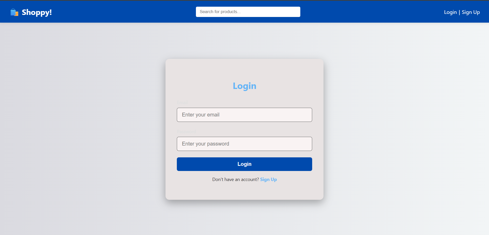
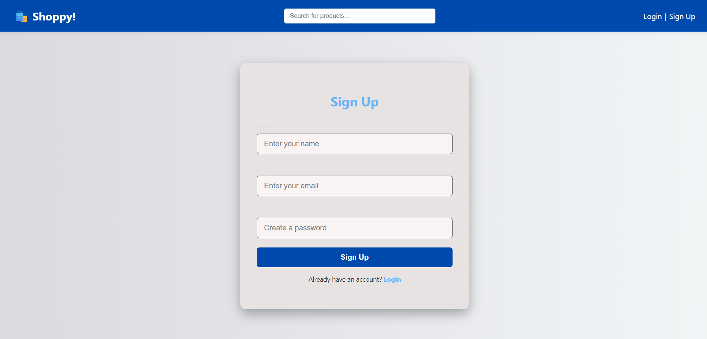
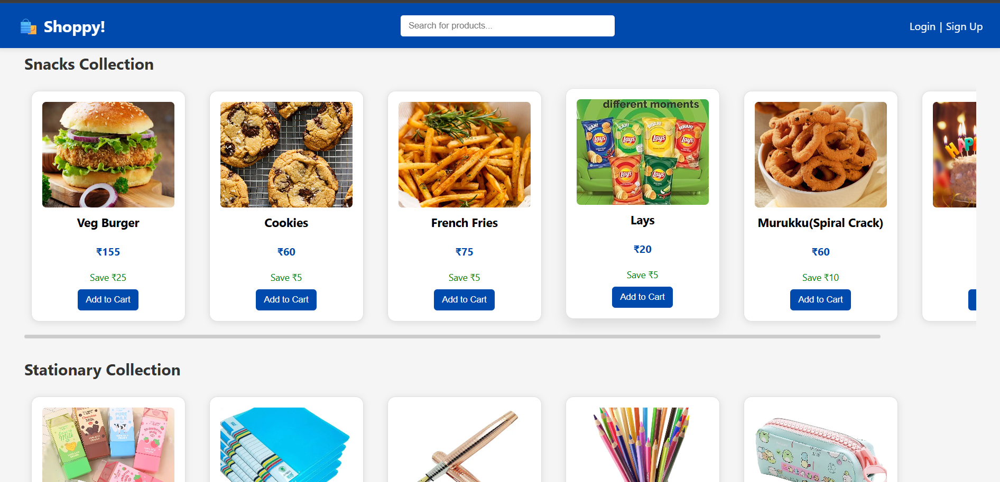
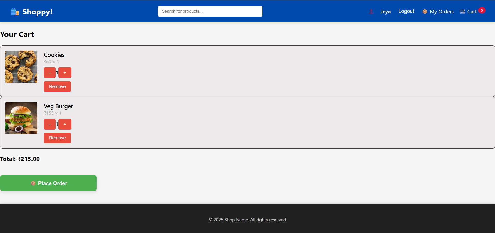
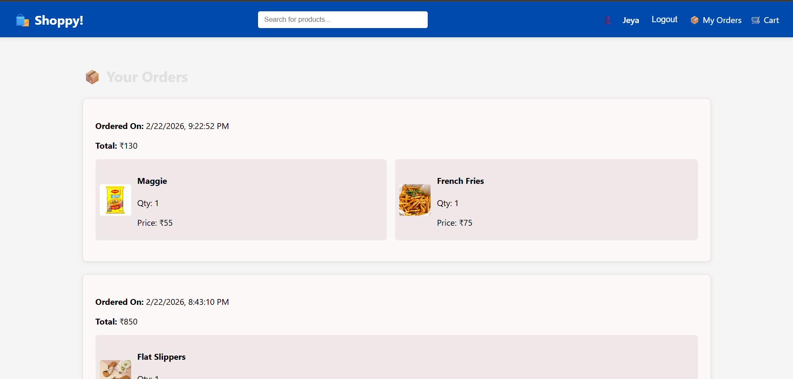
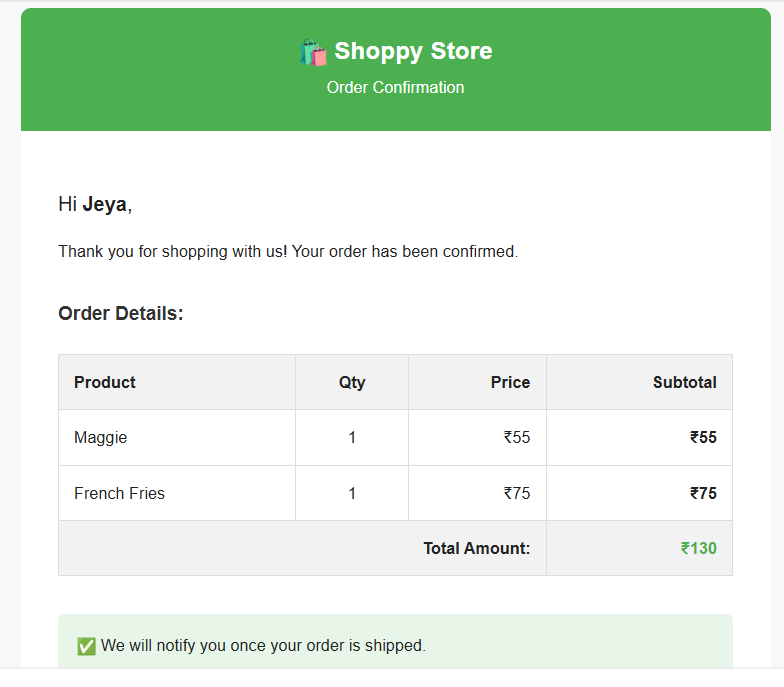
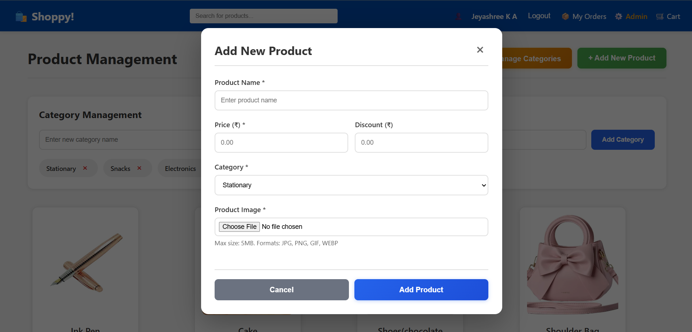
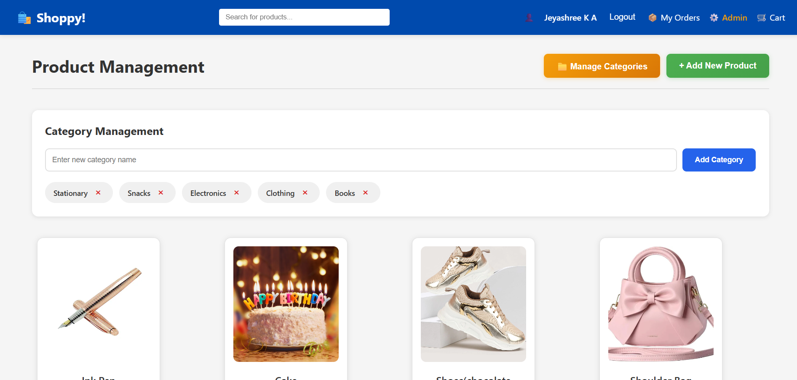

# 🛒 Shoppy – MERN Stack E-Commerce Website

Shoppy is a full-stack e-commerce web application developed using the **MERN stack**.  
It provides a complete online shopping experience with user authentication, cart management, order placement, and admin control.

---

## 🚀 Features

### 👤 User Features
- User registration and login
- Browse products
- Add products to cart
- Place orders
- View order history
- Receive order confirmation email

### 🛠️ Admin Features
- Admin login
- Add new products
- Manage categories
- View and manage orders

---

## 🧰 Tech Stack

### Frontend
- React + Vite
- CSS / Bootstrap

### Backend
- Node.js
- Express.js

### Database
- MongoDB

### Authentication
- JSON Web Token (JWT)

### Image Storage
- **Cloudinary** (cloud-based image storage and optimization)
- Multer (for handling file uploads)

### Email Service
- **Brevo (Sendinblue)** – transactional emails
- Nodemailer- **Frontend:** React
- **Backend:** Node.js, Express.js
- **Database:** MongoDB
- **Authentication:** JWT
- **Email Service:** Nodemailer
- **Image Upload:** Multer

---

## 📸 Screenshots

### 🔐 Login Page

### 📝 Sign Up Page

### 🏠 Home Page

### 🛒 Cart Page

### 🧾 Order History

### 📧 Order Confirmation Email

### 🛠️ Admin Panel

### ➕ Adding New Items (Admin)

### 🗂️ Managing Category (Admin)

---

Live Demo : https://shoppy-ou5z.onrender.com
